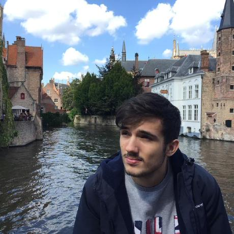

# Daniel González Lopes

 *<-- Me, in Belgium, after eating a waffle (it was a great waffle)*.

- **GitHub**: [dgzlopes](https://github.com/dgzlopes) 
- **LinkedIn**: [danielgonzalezlopes](https://www.linkedin.com/in/danielgonzalezlopes/)
- **Email**: my linkedin username at gmail dot com

During the day, I work at Grafana Labs on k6, doing all kinds of Product/Engineering stuff.

On the side, I have been building [Stacker](https://stackerjs.com/) for a while.

### A few professional things about me
- I love to work in everything that touches Product and Engineering. 
- Focus areas: Observability, Reliability, DevTools, DevEx, and Open Source.

### A few personal things about me
- I enjoy playing tabletop games, shooting instant film, tasting beer, and traveling.
- Lately, I've been learning to climb, ride motorcycles, and fly FPV drones.

© 2024 Daniel González Lopes </a><a href="#" style="float: right;">Back to top</a>
